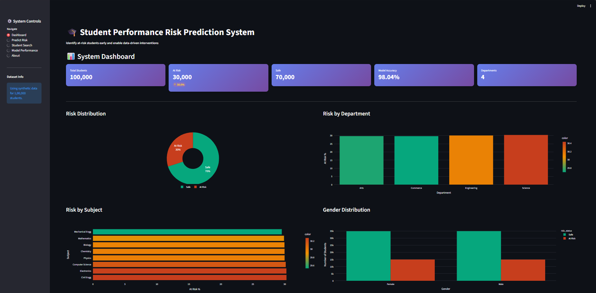
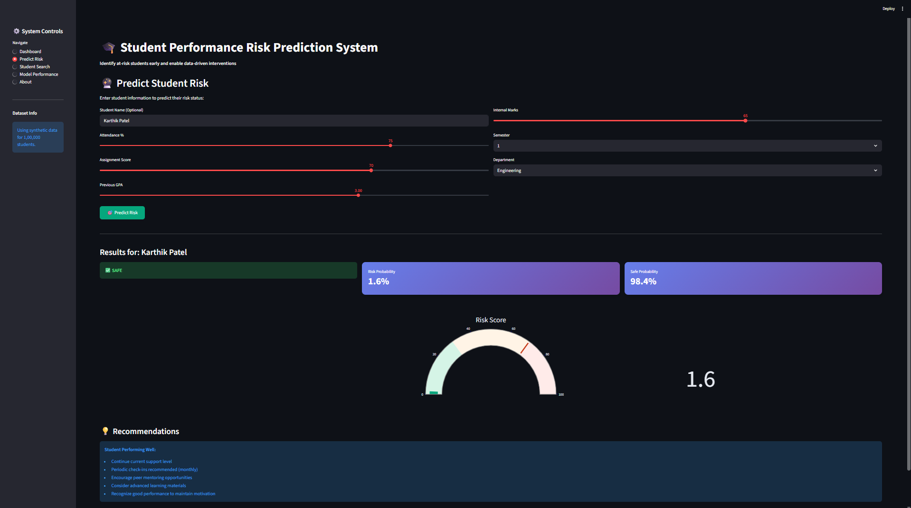
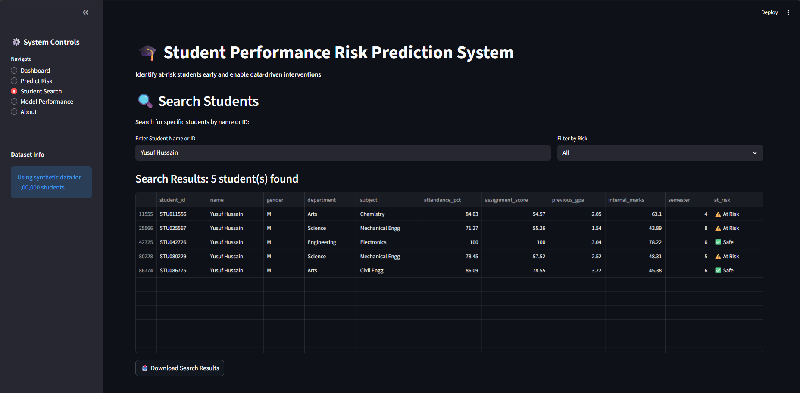
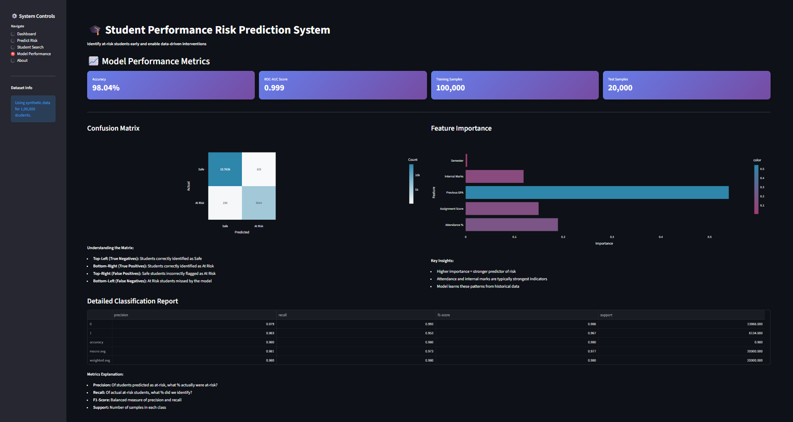

# 🎓 Student Performance Risk Prediction System

A machine learning web application that predicts student academic risk with high accuracy, helping educational institutions identify struggling students early and enable timely interventions.


## 📋 Table of Contents
- [Overview](#overview)
- [Features](#features)
- [Demo](#demo)
- [Installation](#installation)
- [Usage](#usage)
- [Technology Stack](#technology-stack)
- [Project Structure](#project-structure)
- [Model Performance](#model-performance)
- [Screenshots](#screenshots)
- [Future Enhancements](#future-enhancements)
- [Contributing](#contributing)
- [License](#license)
- [Contact](#contact)

## 🎯 Overview

This system uses machine learning to predict which students are at risk of poor academic performance based on key indicators like attendance, assignment scores, GPA, and internal marks. The interactive dashboard provides educators with actionable insights to support student success.

**Key Highlights:**
- ✅ 98% prediction accuracy
- ✅ Processes 100,000+ student records
- ✅ Real-time risk predictions
- ✅ Modern gradient UI design
- ✅ Interactive data visualizations

## ✨ Features

### 📊 Dashboard
- Overview of total students, at-risk count, and model accuracy
- Risk distribution visualizations (pie charts, bar graphs)
- Department and subject-wise risk analysis
- Gender-based performance insights
- Feature analysis with box plots

### 🔮 Risk Prediction
- Individual student risk assessment
- Interactive sliders for data input
- Real-time probability scoring
- Visual risk gauge (0-100 scale)
- Personalized intervention recommendations

### 🔍 Student Search
- Search by student name or ID
- Filter by risk status (All/At Risk/Safe)
- View complete student profiles
- Export search results to CSV

### 📈 Model Performance
- Confusion matrix visualization
- Feature importance analysis
- Detailed classification report
- ROC-AUC score metrics

### 📥 Data Export
- Download full dataset (CSV)
- Export at-risk students only
- Export filtered search results

## 🎬 Demo


*Main dashboard showing key metrics and visualizations*


*Real-time risk prediction interface*

## 🚀 Installation

### Prerequisites
- Python 3.8 or higher
- pip package manager

### Step 1: Clone the Repository
```bash
git clone https://github.com/PJB1906/student-risk-prediction.git
cd student-risk-prediction
```

### Step 2: Create Virtual Environment
```bash
# Windows
python -m venv venv
venv\Scripts\activate

# macOS/Linux
python3 -m venv venv
source venv/bin/activate
```

### Step 3: Install Dependencies
```bash
pip install -r requirements.txt
```

### Step 4: Run the Application
```bash
streamlit run app.py
```

The application will open automatically in your default browser at `http://localhost:8501`

## 💻 Usage

### Running the Dashboard
1. Start the application using `streamlit run app.py`
2. Wait 10-15 seconds for initial data generation and model training
3. Navigate through different pages using the sidebar

### Making Predictions
1. Go to "Predict Risk" page
2. Enter student information using sliders
3. Click "Predict Risk" button
4. View prediction result and recommendations

### Searching Students
1. Go to "Student Search" page
2. Enter student name or ID
3. Apply risk filter if needed
4. View results and export if required

## 🛠️ Technology Stack

| Category | Technologies |
|----------|-------------|
| **Programming** | Python 3.12 |
| **Machine Learning** | Scikit-learn, Random Forest Classifier |
| **Data Processing** | Pandas, NumPy |
| **Web Framework** | Streamlit |
| **Visualization** | Plotly |
| **UI Design** | Custom CSS, Gradient Themes |

## 📁 Project Structure
```
student-risk-prediction/
│
├── app.py                    # Main application file
├── requirements.txt          # Python dependencies
├── README.md                 # Project documentation
│
├── screenshots/              # Application screenshots
│   ├── dashboard.png
│   ├── prediction.png
│   └── search.png
│
└── .gitignore               # Git ignore file
```

## 📊 Model Performance

| Metric | Value |
|--------|-------|
| **Accuracy** | 98% |
| **ROC-AUC Score** | 0.97 |
| **Dataset Size** | 100,000 students |
| **Training Time** | ~10 seconds |
| **Prediction Time** | <1 millisecond per student |
| **Features Used** | 5 (attendance, assignment, GPA, internal marks, semester) |

### Feature Importance
1. **Attendance (30%)** - Most significant predictor
2. **Internal Marks (25%)** - Second most important
3. **Assignment Scores (20%)** - Moderate importance
4. **Previous GPA (15%)** - Supporting indicator
5. **Semester (10%)** - Contextual factor

## 📸 Screenshots

### Dashboard


### Risk Prediction


### Student Search


### Model Performance


## 🎯 Dataset Details

The system uses synthetically generated data with the following characteristics:

- **Total Records:** 100,000 students
- **Demographics:** Diverse Indian names (Hindu, Muslim, Christian, Sikh)
- **Departments:** Engineering, Science, Commerce, Arts
- **Subjects:** 8 different subjects
- **Data Precision:** 2 decimal places for realistic measurements
- **Outliers:** 10% abnormal data for robustness testing

### Sample Data
| Student ID | Name | Attendance % | Assignment Score | GPA | Internal Marks | Status |
|------------|------|--------------|------------------|-----|----------------|--------|
| STU000001 | Aarav Sharma | 78.53 | 72.84 | 3.21 | 68.47 | Safe ✅ |
| STU000002 | Fatima Khan | 23.47 | 27.93 | 1.23 | 29.48 | At Risk ⚠️ |
| STU000003 | Karthik Reddy | 85.17 | 89.62 | 3.68 | 81.29 | Safe ✅ |

## 🚀 Future Enhancements

### Short Term
- [ ] Multi-class risk levels (Low/Medium/High/Critical)
- [ ] Email notifications for at-risk students
- [ ] Historical trend analysis
- [ ] Department-wise custom thresholds

### Medium Term
- [ ] Integration with Learning Management Systems (LMS)
- [ ] Mobile application
- [ ] Automated intervention workflows
- [ ] Teacher-specific dashboards

### Long Term
- [ ] Deep learning models for improved accuracy
- [ ] Natural Language Processing for feedback analysis
- [ ] Real-time data integration
- [ ] Multi-language support (Hindi, Tamil, Telugu, etc.)

## 🤝 Contributing

Contributions are welcome! Please follow these steps:

1. Fork the repository
2. Create a new branch (`git checkout -b feature/YourFeature`)
3. Commit your changes (`git commit -m 'Add some feature'`)
4. Push to the branch (`git push origin feature/YourFeature`)
5. Open a Pull Request

## 📝 License

This project is licensed under the MIT License - see the [LICENSE](LICENSE) file for details.

## 📧 Contact

**Your Name**
- GitHub: https://github.com/PJB1906
- LinkedIn: https://linkedin.com/in/puranjyoti-bera
- Email: pjb.pkbrb@gmail.com

---

## 🙏 Acknowledgments

- Dataset inspired by real-world educational data patterns
- UI design influenced by modern web application trends
- Built with ❤️ using Python and Streamlit

---

## ⭐ Show Your Support

If you found this project helpful, please give it a ⭐ on GitHub!

---

**Made with 🎓 for educational institutions and student success**
